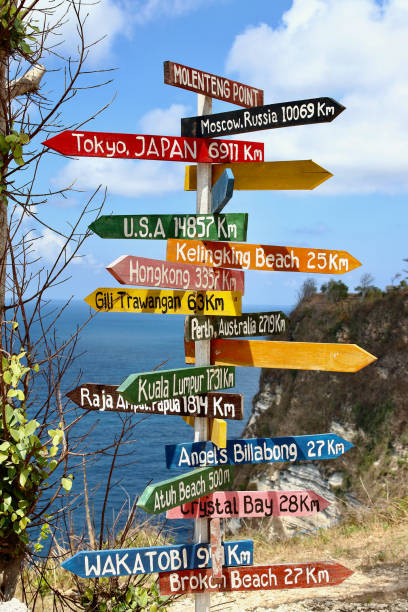

# Signpost Originator

## Purpose

I've always seen those pictures of directional signposts like below, and wanted to find the location strictly off the city names and distances listed on the sign.

## Interesting Tidbits

When testing this, I found that a lot of peoples signs are way wrong.

I use the Haversine Distance formaula to optimize and attempt to find the location.
